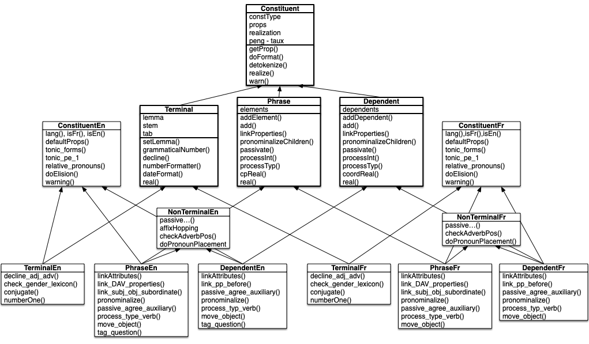

# Architecture of the *jsRealB* and *pyrealb* Text Realizers

<center>
  <a href="mailto:lapalme@iro.umontreal.ca">Guy Lapalme</a><br/>
  RALI-DIRO<br/>
  Université de Montréal<br/>
December 2023
</center>

This document describes the overall code organization of  [*jsRealB*](http://rali.iro.umontreal.ca/rali/?q=en/jsrealb-bilingual-text-realiser), a system written in *JavaScript* that can produce English or French sentences from a specification inspired by the *constituent syntax* formalism. It can be used either within a web page or as a `node.js` module.

The text realizer is at the very end of a text generation pipeline. Important decisions about *What to say* have already been made. Sentence structure and most content word choices must also have been decided. But there is still interesting work to do: the realizer must take care of many language peculiarities such as conjugation, word order, elision, number and person agreements. These might seem to be small *details*, but users appreciate them and find it very annoying or disturbing when they are not properly dealt with. Our realizer allows creating many variations (e.g. negative, passive or interrogative) from a single affirmative sentence structure.

*jsRealB* has been developed by my students since 2013. The source code is now available on [GitHub](https://github.com/rali-udem/jsRealB) with a tutorial and demo applications. in 2018, I decided to build on that experience and redesign the system from the ground up. I kept the same external interface using the existing tests and demos to develop the new version. Only the inner workings have been changed and simplified given my experience with the system over the last few years. *jsRealB* is currently at version 5.0.

I then ported (by hand translation)  *jsRealB*  to python to create [*pyrealb*](https://pypi.org/project/pyrealb/), now at version 3.0. As the *JavaScript* and *python* versions share the same code organization (most class and function names being similar) this document applies to both. 

Before going into the detailed code organization described in this document, I suggest that you first read  the first sections of the [jsRealB tutorial](http://rali.iro.umontreal.ca/JSrealB/current/Tutorial/tutorial.html "jsRealB tutorial") and then take a look at these two documents:

- The high-level [organization and use cases of *jsRealb* and *pyrealb*](https://arxiv.org/pdf/2012.15425.pdf)  
- The use of this technology for [Data-to--text bilingual generation](https://arxiv.org/abs/2311.14808).

This document takes for granted that the user has some knowledge of *python* and *JavaScript*.

## Classes hierarchy

The basic structure of `jsRealB` can be understood as a hierarchy of four classes highlighted with a larger border in the following diagram.  `Terminal,`  `Phrase` and  `Dependent` are subclasses of `Constituent`. This diagram shows for each class, its name, its main local attributes and the most important methods. Arrows indicate subclass relationships.

Parallel class hierarchies have be defined for English and French specific processing: `TerminalEn,`  `PhraseEn` and  `DependentEn` are subclasses of `ConstituentEn`; `TerminalFr,`  `PhraseFr` and  `DependentFr` are subclasses of `ConstituentFr`. Language specific processing common to `PhraseEn` and `DependentEn` is defined in `NonTerminalEn` and similarly for French. 



As can be expected, the same method names appear in the corresponding English and French specific classes. A few *do-nothing* methods are defined when a processing does not apply to a given language (e.g. some gender related processing in English). This diagram uses the python camel-case convention for  class names, JavaScript relies on underscores for separating words in an identifier.

Multiple inheritance is used to determine the appropriate methods according to the language (English or French) in which the instance was originally created. The user does not call the class constructors directly but functions that call an auxiliary function determines the language specific class depending on the current loaded language. 

- In *python*, a class can be derived from more than one superclass so the above class diagram can be implemented directly.  The creation of language specific instances are created as follows:

  ```python
  def NP(*elems,lang=None):
      return phrase("NP",elems,lang)
  ```

  using the following auxiliary function

  ```python
  def phrase(constType,elems,lang=None):
      if lang is None:lang = currentLanguage()  # determine the language to use
      if lang == "en":return PhraseEn(constType, elems)
      return  PhraseFr(constType, elems)
  ```

  All other `Terminal`, `Phrase` and `Dependent` instances are created similarly.

- In *JavaScript*, a class can only derive from one superclass, but [class expressions implementing the mixing of classes](https://justinfagnani.com/2015/12/21/real-mixins-with-javascript-classes/) can be used to create an *empty* class combining many classes with an expression such as the following:

  ```javascript
  class Phrase_en extends English_phrase(English_non_terminal(Phrase)){}
  ```

  The creation of language specific instances are created as follows: 

  ```javascript
  function NP(...elements){return phrase("NP",elements)}
  ```

  using the following auxiliary function

  ```javascript
  function phrase(phraseType,elements){
      return getLanguage()=="en" ? new Phrase_en(elements,phraseType,"en") 
                                 : new Phrase_fr(elements,phraseType,"fr")
  ```

All  functions validate their input, in the case of errors, they generate a warning message on the console. Realization is not stopped, the resulting string is the original lemma enclosed in double square brackets. 

We now briefly describe the main methods of each class.

## `Constituent`
The constructor initializes the object properties `constType` with the parameter, `prop` to an empty object and `realization` to `null`. Most `Constituent` instances also have a link to an object called `peng` (person, number and gender) and verbs to an object called `taux` (tense, auxiliary). This object can be shared between constituents; when it is modified by an option, the new value is also available to others. This is used for carrying out the agreements between sentence component (e.g. the number of a subject can affect the verbe of the sentence).

* `getProp(propName)` : find the current value of the property by first looking if the object has a value for this property; if it is not the case, look in the `peng` and `taux` objects if they exist otherwise return `undefined` or `None`.
* `doFormat()` : during realization, deals with pronoun placement, elision, punctuation, capitalization and inserting HTML tags.
* `deTokenize()` : add appropriate spacing between the realization of each token; if the current object is a `S` or a `root` at the top level, capitalize the first letter unless an option forbids it and add a full stop at the end.
* `realize()` : call `real()` and then `deTokenize()` defined in the current `Phrase` or `Constituent`.
* `warn()` : produce a string explaining an error in the specification using the current language. Note that *jsRealB* or pyrealb itself is used to realize a *localized* of the warning defined as expressions to be realized..

### `ConstituentEn` / `ConstituentFr`

Most methods are single line functions that return language specific values for default properties, tonic forms of pronouns, etc. But the following functions are more complex:

- `doElision()` : in English: decide if the indefinite determiner is written as *a* or *an*; in French, elide some words such as *le*, *je* or *que* that are contracted as *l'*,*j'* or *qu'* when it appears in front of a word starting with a vowel; take also into account the fact that for euphony, words like *ma* or *beau* will be changed to *mon* or *bel* before a word starting with a vowel.
- `warning(args)`: define the list of English or French sentence patterns for warnings; `args` is an array of values, the first of which is a key for indexing the appropriate warning. The other values of `args` are used for customizing the warning.

## `Terminal`

The constructor saves the `lemma` and call `setLemma()`,

* `setLemma(lemma,terminalType)` :   according to the `terminalType` do one of these:

  * `DT` : initialize the date with the value of the lemma and set the default attributes for a date;
  * `NO`: initialize the date with the value of the lemma and set the default attributes for a number;
  * `N`, `A`, `Pro`, `D`: search the lexicon for the `lemma`; from this information set the object attributes `tab` and compute the `stem` to be used in the declension process; other information from the lexicon is saved in the objet `prop` attribute.

* `grammaticalNumber()` : computes the grammatical number for a `NO` in both French and English;

* `decline()` : using the `tab` number and `stem` property, find the string corresponding the gender and number of the object; comparative and superlative are dealt also according the the language;

* `numberFormatter()` : realize a number a string of words or as an ordinal number;

* `dateFormat()` : realize a date according to the language specific options and rules ;

* `real()` : set the `realization` field for this terminal depending on its `constType`:

  * `N`, `A`, `D`, `Adv`, `Pro`: result of `decline()`;
  * `V` : result of `conjugate()`;
  * `DT`: result of `dateFormat()`;
  * `NO`: result of `numberToWord()`, `numberToOrdinal()`, `numberFormatter()` or the current value, depending on the options;
  * `C`, `P`, `Q` : return the lemma;

  Finally call `doFormat()` (defined in `Constituent`) with a singleton string containing this `Terminal`;

### `TerminalEn` / `TerminalFr`

English or French specific processing; these functions are called by `Terminal` instances: 

- `decline_adj_adv()` : process adjective and adverb especially for comparative and superlative
- `check_gender_lexicon()` : check if the specified gender is acceptable according to the lexicon
- `conjugate()` : English or French verb conjugation
- `numberOne()`: realize *un* or *une* in French according to the gender; in English return singular if value is the integer 1 otherwise plural.

### `Phrase`

Note that given the applicative order of execution of JavaScript, this constructor is only called once all its parameters have been created. 
The constructor first calls the `Constituent` prototype and then initializes its list of elements with the `elements` parameter: it copies all elements but the last and then calls `add(element[last])`.

* `add(constituent, position)` : it adds the `constituent` to the list of elements to the given position (last if undefined);

* `linkProperties()` : go through all `elements` and adjust agreement links depending on the type of the current element:
    * `NP` : check the following:
        * make the current `NP` agree with the first `N` taking into account a possible `NO` which can change the number; make elements `D`, `Pro` or `A` agree with this element;
        * if there is an internal `SP` containing a `Pro`: 
            * if the pronoun is `who` (or `qui` in French) make the verb in the `SP` agree with this element because it is subject;
            * in French, check for pronoun `que` that might be a direct object occurring before the verb; this will be checked when conjugating because if it occurs as a past participle it must agree with this NP.
    * `AP` : agrees with the first internal `A`.
    * `VP` : agrees with the first internal `V`.
    * `S`,`SP` : agrees with the subject (i.e. first `NP`,`N`,`Pro` or `CP`) and check special cases
        * in French, an adjective following the verb `être` must agree with the subject;
        * if there is coordination of verbs, then all verbs must agree with the single subject.
    
* `pronominalizeChildren()` : 

* `passivate()` : find the subject and the object and invert them in the sentence, change the verb to passive (i.e. insert the verb `be` and put the original verb to past participle); call `passive_agree_auxiliary` to make the past participle agree with the new subject.

* `processInt()` : transform a sentence into an interrogative form 

    - start with the appropriate interrogative pronoun;

    * move the auxiliary in front of the verb;
    * in some cases, remove the subject, the direct or indirect object.

* `processTyp(types)` : perform structure modification of a `S`, `SP` or `VP` in the following order, when hte appropriate flag is set:
  
    * *passive*: call `passivate()`;
    * *progressive*, *modality*, *negation*, *perfect*: call language specific`processTyp_verb() `
    * *interrogative* : call language specific `processInt()`
    * *exclamative*: terminate the sentence with an exclamation mark.
    
* `cpReal()` : generate terminals by realizing each element of the `CP` and inserting a comma between the first elements and the conjunction before the last;

* `real()` : check if some elements must be pronominalized if so call language specific pronominalize(); call `processTyp()`;  realize each element and combine their list of `Terminal`s into a single list; apply `doFormat()` on the resulting list. 

### `PhraseEn` / `PhraseFr`

- `linkAttributes`, `link_DAV_properties`, `link_subj_obj_subordinate`:
- `pronominalize()` : this applies to a `NP` but it must be called by the *parent* constituent that sets the `parentConst` link
  * find the role of the `NP` (subject, direct or indirect object) within the parent constituent to determine the proper pronoun to use;

  * create the pronoun, make it agree with the current NP and replace it in the sentence 

- `passive_agree_auxiliary()` :
  - French: change the verb into an *ëtre* auxiliary and make it agree with the new subject
  - English: do nothing

- `processTyp_verb()` : *progressive*, *modality*, *negation*, *perfect*:
  * French:
    * *progressive*: change the verb to `être en train de` *verb*, where `être` is conjugated like the original verb which is then set to infinitive;
    * *modality* : add the appropriate modality verb in front of the verb which is set to infinitive;
    * *negation* : insert `ne` before the verb and set a conjugation flag that will used when conjugating the verb at realization time.
  * English: these options are implemented with auxiliary and modality verbs using the "affix hopping" rules by building a list of auxiliaries and affixes; these lists are then processed to create a list of Terminals with the appropriate conjugation flags; this list then replaces the original verb;
- `move_object()` : for interrogative
  - English: move the auxiliary to the front
  - French: move the verb before the subject  the inversion rule

- `tag_question()` :
  - English : negate the verb of the affirmative sentence, pronominalize the subject and them to the end of the sentence
  - French: add *n'est-ce pas* at the end of the sentence.


## `Dependent`

This is also a subclass of `Constituent`, its structures closely parallels that of `Phrase`, but its children are a single `Terminal` instance and list of *dependents* (instances of `Dependent`) instead of *elements* which are `Terminal` or `Phrase` instances.

## `NonTerminalEn` / `NonTerminalFr`

These classes contains methods shared between `Phrase` and `Dependent` instances. In particular, this where is located the Affix Hopping algorithm for English verb conjugation in sentence modifications. There many single line methods for dealing with passive sentences in either French or English.  The language specific positioning of adverbs is dealt in a method of this class. In French, the placement of clitic and pronouns is determined here, while there is nothing to do in this respect in English.  

## Lexicon

These functions can be called by the user to change global information for the realizer. They are described in the [documentation](../documentation/user.html#vocExtension).

* `loadEn(trace)` : set the current lexicon and rule table for realizing sentences in English;
* `loadFr(trace)` : set the current lexicon and rule table for realizing sentences in French;
* `addToLexicon(lemma, infos, lang)` : add a new lemma to the current lexicon by giving information for conjugation and lemmatization in the specified lexicon;
* `updateLexicon(newLexicon,lang)` : add to the current lexicon, the entries of the specified lexicon;
* `getLemma(lemma,lang)` : return the information for a given lemma from specified lexicon ;
* `getLanguage()` : return the current realization language;
* `getLexicon()` : return the current lexicon;


## JSON-tools

* `fromJSON(json,lang)` : create a jsRealB structure from a JSON object; if `lang` is not given, the current language is used;
* `.toJSON()`, `.toJSON()` : create a JSON structure from a *jsRealB* structure ;
* `ppJSON(json)` : create an indented string showing the structure of a JSON structure (not specific to jsRealB, but useful for debugging);
* `Phrase.fromJSON`, `Dependent.fromJSON`, `Terminal.fromJSON`, `setJSONprops` : internal functions used by `fromJSON()`;
* `Phrase.prototype.toJSON`, `Terminal.prototype.toJSON`, `Terminal.prototype.toJSON` :internal functions used by `toJSON()`.

## `jsRealB.js` / `utils.py`

This is not a class, but a file that imports all functions and classes and
exports them, so that this is the only file to import to access *jsRealB*.
It also adds a utility functions and some useful constants..  All functions that create `Terminal`, `Phrase` and `Dependent` instances are also defined here, 

* `oneOf(elems)` : selects *randomly* an element from a list, but trying to avoid direct repetitions. If the selected element is a function, then call it without argument and return its value.
* `mix(elems)` : shuffle the elements, if any element is a function then return its value.
* ` jsRealB_version` : the current version of jsRealB
* `getSavedWarnings()`, `resetSavedWarnings()`, `setExceptionOnWarning()`: change the warning are dealt with.
