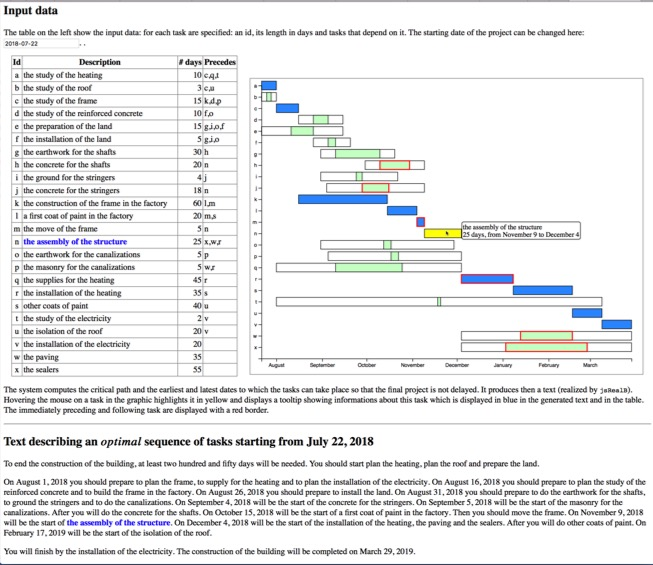
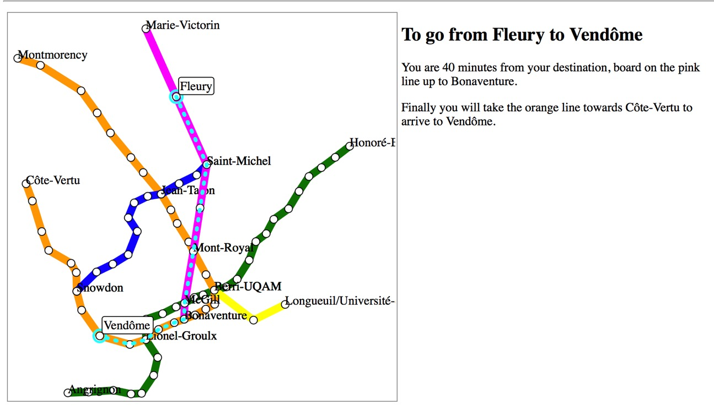

# jsRealB - A JavaScript Bilingual Text Realizer for Web Development

*Version 3.0 - December 2019*

**Natural language generation** is a field of artificial intelligence that focuses on the development of systems that produce text for different applications, for example the textual description of massive datasets or the automation of routine text creation.

The web is constantly growing and its content, getting progressively more dynamic, is well-suited to automation by a realizer. However existing realizers are not designed with the web in mind and their operation requires much knowledge, complicating their use.

**jsRealB is a text realizer designed specifically for the web**, easy to learn and to use. This realizer allows its user to build a variety of French and English expressions and sentences, to add HTML tags to them and to easily integrate them into web pages.

**jsRealB can also be used in Javascript application** by means of a `node.js` module.

The documentation can be accessed [here](http://rali.iro.umontreal.ca/JSrealB/current/documentation/user.html). You can switch language in the upper right corner of the page.

**Caution**

* `jsRealB` can be used (out of the GitHub!) in a web page using only `jsRealB.min.js` (or `jsRealB.js`) in the [`dist`](dist/) directory.
* [`node.js`](https://nodejs.org/) is necessary for the Javascript applications and for minifying the Javascript using [`terser`](https://www.npmjs.com/package/terser "Downloads").
* The current build process relies on the availability of some Unix tools such as `makefile`, `cat` and output redirection (`>`).
* Windows users (and others) will therefore want to use the pre-built files in the [`dist`](dist/) directory.

## Directories
* [`Architecture`](Architecture/):
    * `README.md` : Description of the architecture of the system; the second section goes into details of the organization of the source files and describes the main methods.
* [`build`](build/): build system to create the JavaScript library; more details in the [document on the architecture of the system](Architecture/README.md) 
    * `Constituent.js`: *Constituent* is the top class for methods shared between *Phrase*s and *Terminal*s 
    * `Date.js` : utility functions for dealing with date formatting
    * `module-end.js` : lines to add at the end when creating a module from js files
    * `module-exports.js` : list of exported identifiers when creating a module from the js files
    * `module-start.js` : line to add at the start when creating a module from js files
    * `Number.js` : utilisy function for dealing with number formatting
    * `Phrase.js` : subclass of *Constituent* for creating complex phrases
    * `Terminal.js` : subclass of *Constituent* for creating a single unit (most often a single word)
    * `Utils.js` : useful functions that do not belong to the *constituent*s
    * `Warnings.js` : list of functions to generate warnings in case of erroneous specifications using jsRealB itself
* [`data`](data/):
    * `lexicon-dme.json` : a *comprehensive* English lexicon (33926 entries) in json format
    * `lexicon-dmf.json` : a *comprehensive* French lexicon (52512 entries) in json format
    * `lexicon-en.js` : basic English lexicon (5238 entries)
    * `rule-en.js` : English conjugation and declension tables
    * `lexicon-fr.js` : basic French lexicon (3720 entries)
    * `lexicon.jsonrnc` : JSON-RNC file for validating a lexicon
    * `rule-fr.js` : French conjugation and declension tables
    * `lexiconFormat.html` : basic description of the format of the lexicon
* [`demos`] : see next section
* [`dist`](dist/): pre-built JavaScript files ready for production use, they already include the basic English and French lexicons and the English and French rule tables
    * For use in a web page : ``
        * `jsRealB.js`: packages all .js files of the `build` directory as a module and exports only the main functions
        * `jsRealB.min.js`: minified version of the above
    * For use as a node.js module :
        * `jsRealB-node.js`: packages all .js files of the `build` directory as a module and exports only the main functions
        * `jsRealB-node.min.js`: minified version of the above
    * `jsRealB-filter.js`: example of use of the node.js module to create a Unix filter for `jsRealB`
    * `jsRealB-server.js`: example of use of the node.js module to start a web server that realizes sentences
    * `jsRealB-server-dme.js`: same as above but loading the *comprehensive* lexicon
    * `testServer.py`: example of a Python program using the `jsRealB` server
    * `datedCore.js`: intermediary file used during the makefile for saving the date the makefile was created. This file should probably be deleted after the makefile 
* [`documentation`](documentation/): in both English and French. The examples are generated on the fly by embedding `jsRealB` in the page. [*Consult the documentation*](http://rali.iro.umontreal.ca/JSrealB/current/documentation/user.html)
    * `user.html`: HTML of the core of the page (`div[id]` correspond to variables in `user-infos.js`)
    * `style.css`: style sheet
    * `user-infos.js`: definitions of variables containing the examples
    * `user.js`  : JavaScript helper script.
* [`IDE`](IDE/) : An Integrated Development Environment built upon the `Node.js` *read-eval-print loop* that includes `jsRealB` to easily get the realization of an expression, to consult the lexicon, the conjugation and declination tables. It is also possible to get a *lemmatization*: i.e. the `jsRealB` expression corresponding to a form. See the [`README.md`](IDE/README.md) file to learn how to use it.
* [`Tests`](Tests/) : unit tests (using [QUnit](https://qunitjs.com "QUnit")) of jsRealB in both French and English.
    * `testAll.html` : load this file in a browser to run all tests
* [jsRealB **Tutorial**](Tutorial/). [*Read the tutorial*](http://rali.iro.umontreal.ca/JSrealB/current/Tutorial/tutorial.html)
* *Files in the current directory*:
    * `jsRealB2.html` : simplistic web page that loads each Javascript file from the `build` directory; this is very useful for testing using the Javascript inspector
    * `jsRealB2.js` : some test sentences that are displayed on the console when loading the above file
    * `makefile` : for building files in the dist and managing the system
    * `README.md` : this file

## Demos
### Simple examples on a single sentence
* Evaluate a jsRealB expression and display its realization in a web page in either English or French.
    * [*Execute*](http://rali.iro.umontreal.ca/JSrealB/current/demos/Evaluation/index.html)
* Show the use of loops in Javascript to create repetitive texts
    * English: [99 bottles of beer](demos/99BottlesOfBeer). [*Execute*](http://rali.iro.umontreal.ca/JSrealB/current/demos/99BottlesOfBeer/index.html)
    * French: [1 km à pied](demos/KilometresAPied). [*Execute*](http://rali.iro.umontreal.ca/JSrealB/current/demos/KilometresAPied/index.html)
* Tests of specific features
    * French and English sentences modified with time, number and conjugation: [Date generation](demos/date) [*Execute*](http://rali.iro.umontreal.ca/JSrealB/current/demos/date/index.html)
    * Type a French or English sentence that will be realized with all possible sentence modifiers [Sentence variants](demos/VariantesDePhrases) [*Execute*](http://rali.iro.umontreal.ca/JSrealB/current/demos/VariantesDePhrases/index.html)
    * French or English conjugation and declension of a word [Conjugation and declension](demos/inflection) [*Execute*](http://rali.iro.umontreal.ca/JSrealB/current/demos/inflection/index.html)
    * Generate a table (both in English and French) showing the different forms of pronouns in the original specification and also using the tonic and clitic options
* User interface to create a simple sentence with options. The system shows the `jsRealB` expression and its realization. It is also possible to ask for a random sentence using words of the lexicon.
    * [*RandomGeneration*](demos/randomGeneration/) 
      [*Execute in English*](http://rali.iro.umontreal.ca/JSrealB/current/demos/randomGeneration/english.html) 
      [*Execute in French*](http://rali.iro.umontreal.ca/JSrealB/current/demos/randomGeneration/french.html)

### Text realization
* Create an [Exercise in Style](https://en.wikipedia.org/wiki/Exercises_in_Style) which creates the structure of the original story of Raymond Queneau in both French and English. Using menus, some elements of the text can be modified and the modifications are highlighted in the web page. [Exercises in style](demos/ExercicesDeStyle) [*Execute*](http://rali.iro.umontreal.ca/JSrealB/current/demos/ExercicesDeStyle/index.html)
* Reproduce a classical fairy tale in which hovering over a sentence, shows the underlying `jsRealB` expression 
    * in French : *Le petit chaperon rouge*   [*Execute*](http://rali.iro.umontreal.ca/JSrealB/current/demos/PetitChaperonRouge/PetitChaperonRouge.html)
    * in English : *Little Red Riding Hood*  [*Execute*](http://rali.iro.umontreal.ca/JSrealB/current/demos/PetitChaperonRouge/LittleRedRidingHood.html)

###  Data to Text applications
* **Description (in French) of a list of events** and associated informations given as a json file [Événements](demos/Evenements) [Execute](http://rali.iro.umontreal.ca/JSrealB/current/demos/Evenements/index.html)
* **Description of list of steps for the building of a house**, given information about tasks, the duration and the precedence relations between them. 

    <!--  -->
    
    
  The system first computes the critical path to find the start and end times of each task. It then creates a graphic for displaying the PERT diagram and an accompanying text to explain the steps to follow. It is possible to interactively change the start date and to explore the graphic with the mouse which also uses jsRealB to generate the text of the tooltips. 
    * [English](demos/Data2Text/building.html) [*Execute*](http://rali.iro.umontreal.ca/JSrealB/current/demos/Data2Text/building.html)
    * [French](demos/Data2Text/batiment.html) [*Execute*](http://rali.iro.umontreal.ca/JSrealB/current/demos/Data2Text/batiment.html)
* **Itinerary description in an *optimistic* Montréal Métro network**. The system shows an interactive map of the Montréal Métro station with a new line. When a user clicks two stations, the systems realizes a text describing the itinerary to go from the first station to the second. 

    <!--  -->
    
    
    The langage of the web page and of the realization can be changed interactively by clicking in the top right of the page. [Metro](Tutorial/metro.html) [*Execute*](http://rali.iro.umontreal.ca/JSrealB/current/Tutorial/metro.html)

### Test demos
* The demos are usually run using the *compiled* version. But after modification of the source files, the version with the separate loading of the file can be obtained by commenting/uncommenting some `` lines at the start of the html file. The shell script `testDemos.sh` can be used to do this while keeping the original intact. If the script is called with a name of an HTML file, then that file is uncommented and shown in the browser (using the `open` command on the MacOS). With no argument, then all demos are displayed in different tabs. The script wait for 5 seconds between each try.
## Design of the system

The current version (3.0) is a redesign and reimplementation of the previous version while keeping intact the external interface, i.e. same name of functions for building constituents, for option names and for global functions. This means that applications using only the external interface of `jsRealB` can be run unchanged.

[This document](Designing/README.html) first describes the transformation steps within the realizer using a few examples. It then gives an overview of the implementation explaining the role of the main classes and methods.

## Authors
jsRealB was updated, developed and brought to its current version by [Guy Lapalme](http://www.iro.umontreal.ca/~lapalme) building on the work of:

1. [Francis Gauthier](http://www-etud.iro.umontreal.ca/~gauthif) as part of his summer internship at RALI in 2016; 
2. [Paul Molins](http://paul-molins.fr/) as part of an internship from INSA Lyon spent at RALI, University of Montreal in 2015;
3. [Nicolas Daoust](mailto:n@daou.st) developed the original concept in the JSreal realizer for French only in 2013.

For more information, contact [Guy Lapalme](http://rali.iro.umontreal.ca/lapalme).      
