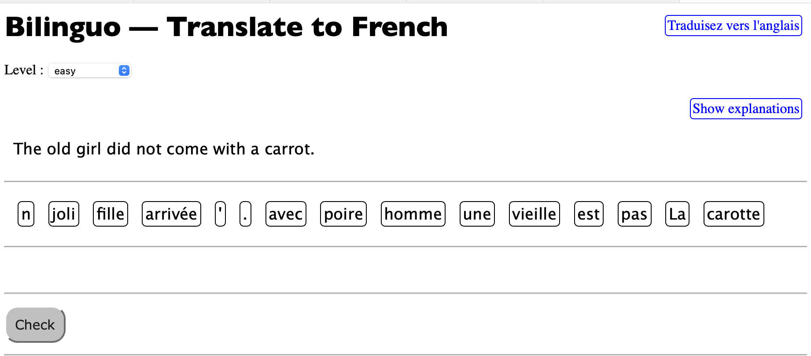
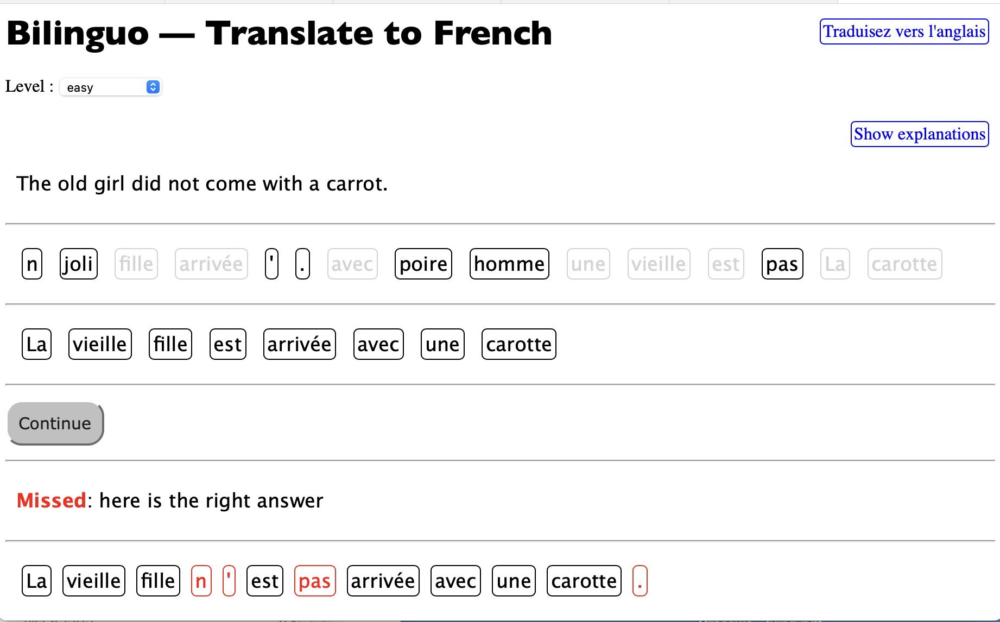
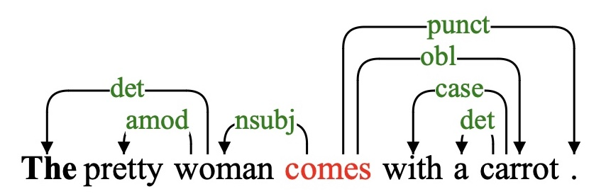
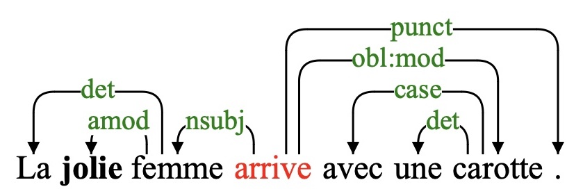

# [Bilinguo](https://github.com/rali-udem/jsRealB/tree/master/demos/Bilinguo):  French to-and-from English translation exercises

We describe how `jsRealB` was used to build a [web application that proposes French or English source sentences to translate using words in the target language to be put in the appropriate order](http://rali.iro.umontreal.ca/JSrealB/current/demos/Bilinguo/index.html). The system then checks if the target words have been put in the appropriate order. A few *distractor words*  are also added to the target words in order to make the exercises more challenging .  This is an adaptation of a language practice drill made available by [Duolinguo](https://www.duolingo.com/learn).

## User Interface

The following figure shows a typical exercise in which an English source sentence is displayed with a list of French tokens to be put in the right order to form the translation of the original sentence; the expected translation is «*La vieille fille n'est pas arrivée avec une carotte*». Not all tokens are necessary for the translation.  When the user clicks on a French token, it is added at the end of the next line. Clicking a token in the translation puts it back where it appeared originally. Given the fact that important aspects of the sentences are chosen randomly, their semantics, or even their interest, is sometimes dubious.



When the user considers that the translation is complete,  the `Check` button is clicked. As shown in the following figure, the system compares the list of tokens with the expected ones. If both lists are identical, then a `Bravo` is displayed, otherwise the differences are highlighted in red. The system  also keeps track of the number of right answers, but currently these values are not saved and there is no *leaderboard*, this being left as a future work. Clicking on the `Continue` button, displays another sentence to translate.



Implementing this system with a list of canned sentences is relatively straightforward, but in our case we decided to take advantage of the bilingual sentence realizer `jsRealB` to create parallel random variations of the source and target sentences. In this way, many different exercises can be obtained from a single sentence pair example with word, tense and sentence structure variations. 

The following shows the sentence pair and the word variations given for the above example.

```
La jolie femme arrive avec une carotte.
The pretty woman comes with a carrot.
jolie,pretty ; jeune,young; vieux,old
femme,woman ; homme,man; fille,girl; garçon,boy
carotte,carrot; tomate,tomato; pomme,apple; poire,pear
```

The first two lines give a French sentence and its English translation. The next lines give alternative pairs of French and English words that can be used instead of the ones in the first pair that appear in the sentences. In our example, `pretty` was replaced by `old` and `woman` by `girl`;  the present tense of the original sentence was replaced by the past tense and the whole sentence was negated. The types of allowed sentences modifications depend on the level of difficulty that can be chosen using the menu above the source sentence.  The choice between possibilities is done randomly.

We now briefly describe the `jsRealB` bilingual realizer and how it is used for generating many different sentences from a single specification.

## The English-French sentence realizer `jsRealB`

[`jsRealB` (JavaScript Realizer Bilingual)](https://arxiv.org/pdf/2012.15425.pdf)  is a French and English text realizer that generates well-formed expressions and sentences. As its name indicates, `jsRealB` is written in JavaScript, a programming language that, when used in a web page, runs in the client browser.

In `jsRealB`, JavaScript expressions create data structures corresponding to the parts of the sentence to create. When the need arises to produce a string realization, the data structure is traversed to produce the tokens of the sentence taking into account agreements, conjugation, punctuation and elision. The realizer accepts two types of input: constituents or dependents, in this application the dependent notation is used. The following structure is realized as:`The pretty woman comes with a carrot.`

```javascript
root(V('come'),
     subj(N("woman"),
          det(D('the')),
          mod(A("pretty"))),
     comp(P('with'),
          comp(N("carrot"),
               det(D('a')))))
```

Variations on this basic structure are obtained by adding *options* for number `.n(..)`, tenses `.t(..)` and type of sentence `.typ(...)`.  For example, the following structure

```javascript
root(V('come'),
     subj(N("woman").n("p"),
          det(D('the')),
          mod(A("pretty"))),
     comp(P('with'),
          comp(N("carrot"),
               det(D('a'))))).t("ps").typ({"neg":true})
```

is realized as `The pretty women did not come with a carrot.`

Functions are a convenient way of parameterizing a  `jsRealB`expression. Here is a function that returns a `jsRealB` expression

```javascript
function gen(n,pretty,woman,carrot){
    return root(V('come'),
                subj(N(woman).n(n),
                     det(D('the')),
                     mod(A(pretty))),
                comp(P('with'),
                     comp(N(carrot),
                          det(D('a')))))
}
```

The result of the call `gen("p","old","girl","apple") ` is realized as `The old girls come with an apple.`

This result can be further modified, such as `gen("p","old","girl","apple").t("ps").typ({"neg":true})` realized as `The old girls did not come with an apple.`

As these modifications can be applied similarly to both languages, once a type of modification has been chosen for the source structure, it is also applied to the target structure and the parallel realizations for both the source and target languages are obtained.  

## Creation of English and French sentence structures

The only *problem* left is the creation of the parallel English and French functions for a given pair of sentences such as the following. 

```javascript
 "en":(n,pretty,woman,carrot)=>
  root(V('come'),
       subj(N(woman).n(n),
            det(D('the')),
            mod(A(pretty))),
       comp(P('with'),
            comp(N(carrot),
                 det(D('a')))))),
  "fr":(n,jolie,femme,carotte)=>
   root(V('arriver'),
        subj(N(femme).n(n),
             det(D('le')),
             mod(A(jolie))),
        comp(P('avec'),
             comp(N(carotte),
                  det(D('un'))))),   
```

Arrow functions are used to simplify somewhat the functional notation. These functions will be stored as fields in a JavaScript object.

After writing by hand a few parallel `jsRealB` expressions, we decided to streamline  the process of creating such parallel expressions . Given our past experience in using [Stanza](https://stanfordnlp.github.io/stanza/index.html) for [parsing sentences and generating questions](https://aclanthology.org/2022.acl-short.83), we decided to apply a similar technique to create the `jsRealB` structures for both English and French.

As Stanza is written in Python, we developed a Python program that uses Stanza for parsing French and English affirmative sentences at the present tense to produces dependency structures such as these:

                          

These dependencies are then transformed into the dependency format expected by `jsRealB` . This is mostly a matter of changing relation names, part-of-speech tags and token features. To check the resulting dependency structure,  [pyrealb](https://pypi.org/project/pyrealb/) is used in Python for realization as it uses the same notation as `jsRealB`.

The output of this program is a JavaScript program used as a script for the [Bilinguo web page](https://github.com/rali-udem/jsRealB/tree/master/demos/Bilinguo). The following shows an excerpt of the generated script.

```javascript
const sentences = [
{
  "id":1,
  "level":1,
  "text":'The pretty woman comes with a carrot. | La jolie femme arrive avec une carotte.',
  "TEXT":'The pretty woman comes with a carrot. | La jolie femme arrive avec une carotte. ',
  "en":(pe,n,pretty,woman,carrot)=>
  root(V('come'),
         subj(N(woman).n(n),
              det(D('the')),
              mod(A(pretty)).pos('pre')),
         comp(N(carrot),
              mod(P('with')).pos('pre'),
              det(D('a')))),
  "fr":(pe,n,jolie,femme,carotte)=>
  root(V('arriver'),
         subj(N(femme).n(n),
              det(D('le')),
              mod(A(jolie)).pos('pre')),
         comp(N(carotte),
              mod(P('avec')).pos('pre'),
              det(D('un')))),   
  "params":[pes,numbers,
          [['joli', 'pretty'], ['jeune', 'young'], ['vieux', 'old']],
          [['femme', 'woman'], ['homme', 'man'], ['fille', 'girl'], ['garçon', 'boy']],
          [['carotte', 'carrot'], ['tomate', 'tomato'], ['pomme', 'apple']]],
},
...
];
```

 Each sentence has an identification number (`id`), a difficulty level `(level`), the original sentences (`text`) and the realized text (`TEXT` ) by `pyrealb` using the first parameter pair (`params`) in each list.   In this case, the algorithm that transforms the output of Stanza to `jsRealB` dependencies produced slightly different structures from the ones presented above, but their realized text is the same. Each realizer function has two standard parameters (person (`pe` a number between 1 and 3)  and number (`n`  either `"p"` or `"s"`)) even if they are not always needed.  The parameters are applied to the subject, either a noun or a pronoun. As jsRealB takes care of the agreement between the subject, the verb and determiners, only the number of the noun needs to be specified.

For creating a new exercise,  the JavaScript code selects a person, a number, tense (past, present or future) and a type of sentence modification such as *negation*, *progressive*, *interrogative*, *tag question*, or *modal* depending on the difficulty level. It also selects a parameter in each list. The realizer functions for English and French are called with these parameters. 

The source sentence is displayed directly while the target sentence is split into tokens which are shuffled with other values in the same lists to be used as distractors. The tokens for the target sentence are then displayed in the web page. Once the user asks for the translation to be checked, the edit distance between the user list and the expected list is computed. When there are no differences, a congratulation meesage is displayed, otherwise the tokens that differ are highlighted.

The automatic transformation from sentences to the JavaScript functions produces a usable result, but being heuristic, this mapping is not always optimal. So it must be checked before being put in *production*. In order that all of sentence modifications generate *semantically correct* sentences, the original sentence should be at the active mood and not contain time information (e.g., *yesterday* or *tomorrow*) nor inversion because of the way that *jsRealB* generates the modification.  Currently, all modifications can be applied to any sentence, but it would be perhaps be interesting to limit some sentences to a few types of modifications. This feature is not yet implemented. 

Because the parameters are strings, only single lemmata can be changed. This limitation does not allow the translation of a single word such as *potato* or *frites* by a multiple word expressions such as *pomme de terre* or *french fries*. 

Another difficulty occurs when some alternatives do not have necessarily the same part of speech.  For example, the French alternatives for *Il fait {beau|mauvais|nuageux} aujourd'hui* could be translated by *it is {nice weather|bad weather|cloudy} today* .

Such cases must be fixed by manually changing the generated code which is less convenient. In principle it would be possible to improve the Python code for JavaScript generation process to take some of these peculiarities into account.

Note that the translations do not need to be strictly parallel in their structure. For example, the translation pair *Mon chien s'appelle Max* / *My dog's name is Max* can be represented as

```javascript
(chien,Max) =>                         (dog,Max)=>
  root(V('appeler'),                      root(V('be'),
       subj(N(chien),                          subj(N('name'),
            det(D('mon'))),                         mod(N(dog).a("'s"),
       comp(Q(Max))).typ({refl:true})                   det(D('my').pe(1))).pos("pre")),
                                               comp(Q(Max)))
```

These techniques allow creating a versatile language drill tool that can be controlled by a teacher by either providing appropriate sentences or sentence patterns with lists of alternative parameters.

# Conclusion

This document has shown how `jsRealB` was used to build translation drill exercises by taking advantage of the one its most interesting features, the modification of a basic sentence structure by means of parameters and options for both English and French thus creating sentences that are literal translation of each other. It is thus possible to build a wide variety of different parallel sentences from a single pair of examples.

#### Acknowledgement

Thanks to Fabrizio Gotti for his interesting suggestions during the development of this application.

#### Contact [Guy Lapalme](mailto:lapalme@iro.umontreal.ca)

[Link to the web application](http://rali.iro.umontreal.ca/JSrealB/current/demos/Bilinguo/index.html)
