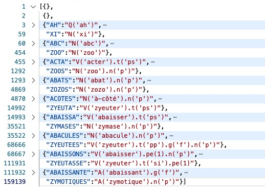
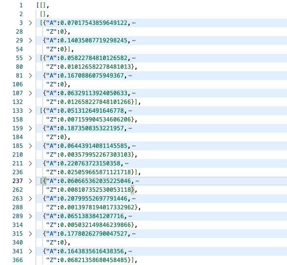

<center style="font-size:3em; font-family: 'Open Sans'; font-weight: bold">Création de grilles de<br/> <i>Mots croisés</i></center>

<center><a href="mailto:lapalme@iro.umontreal.ca">Guy Lapalme</a><br/>RALI-DIRO<br/>Université de Montréal<br/>Octobre 2025</center>

[Ce dossier](https://github.com/rali-udem/jsRealB/tree/master/demos/MotsCroises) renferme les fruits de mes tentatives de génératio*n automatisée* de grilles de mots croisés à l’aide des mots qui peuvent être formés avec *[jsRealB](https://github.com/rali-udem/jsRealB)*. Cette activité, qui est aussi une source de divertissement pour moi, découle de mon goût pour les mots croisés et de la création récente d’un [outil informatique pour aider à les résoudre](http://www.iro.umontreal.ca/~lapalme/Developpement-MCWiktionnaire/Developpement-MCWiktionnaire.html).

Voici une grille (10 lignes par 8 colonnes) produite par le programme, ainsi que les définitions associées : une expression *jsRealB* permettant de réaliser le mot de la grille. Les `_` indiquent les cases blanches et les `█` les *cases noires*. La solution de cette grille est donnée à la fin de l'explication du processus de création de la grille [en 2.3.](#complétion-de-la-grille) 

```javascript
    1 2 3 4 5 6 7 8
 1| _ _ _ _ _ _ _ _
 2| _ _ _ _ _ _ _ _
 3| _ _ _ _ _ _ █ _
 4| _ _ █ _ █ _ _ _
 5| _ _ _ _ _ _ █ _
 6| _ _ █ _ █ _ _ _
 7| _ _ █ _ _ _ █ _
 8| _ █ _ _ _ _ _ _
 9| _ _ _ _ _ _ █ _
10| _ _ _ _ _ _ _ _

Horizontalement
1 : V('recarder').t('pp').g('f')
2 : A('étésien').n('p')
3 : V('piper').t('pp').g('f').n('p')
4 : V('être').pe(2) - N('écu')
5 : N('rictus')
6 : Pro('ce') - N('pré')
7 : V('être').pe(2) - V('suer').t('pp')
8 : N('perré').n('p')
9 : V('égarer').t('pp').g('f')
10 : V('zoner').t('si').pe(2)

Verticalement
1 : V('repercer').t('f').pe(2).n('p')
2 : N('étisie').n('p') - N('go')
3 : N('cep') - N('pan')
4 : V('aseptiser').t('f')
5 : V('rire').t('s').pe(1) - N('ure').n('p')
6 : V('désespérer').t('s').pe(2)
7 : Pro('en')
8 : N('essuyeur').g('f').n('p')
```

Le *défi* est de produire à partir d’une liste de mots une grille contenant certains de ces mots dans les deux sens, en limitant le nombre de cases noires. Comme liste de mots, j'ai choisi l'ensemble des formes réalisables par *jsRealB*. Ce texte illustre des exemples en français, mais l’outil peut également générer des grilles avec les mots anglais qui peuvent être créés avec *jsRealB*.

Les grilles sont conçues selon les principes des mots croisés en français : insérer un maximum de lettres en minimisant le nombre de cases vides. Les cases noires des grilles créées dans les pays anglophones sont généralement disposées de manière symétrique avant avant le choix des mots. De plus, les mots de deux lettres sont interdits. Les grilles en français permettent l’utilisation de mots de deux lettres ainsi *que* de quelques *chevilles*, c’est-à-dire de courtes suites de lettres qui ne figurent pas nécessairement dans la liste de mots.

L'art d'un bon verbicruciste (la personne qui construit des grilles à résoudre) réside surtout dans la qualité ou la subtilité des définitions, qui ne devraient jamais être celles d'un dictionnaire de langue. Cet aspect n'est pas abordé ici.

La motivation initiale de ce travail était de produire une nouvelle démo de *jsRealB*. C’est pour cette raison qu’il est programmé en Node.js. Cependant, je ne suis plus convaincu que le problème de création de grilles de mots croisés soit vraiment pertinent. En effet, il n’y a aucun défi de génération de texte et les définitions sont *triviales*. On peut tout de même envisager de l’utiliser comme un outil d’apprentissage de la notation pour la création des symboles terminaux en *jsRealB*.

La conception des grilles s’est avérée être une tâche fascinante avec plusieurs défis intéressants, d'ailleurs elle m’a pris beaucoup de temps. Le processus se déroule en deux étapes : création de la liste des mots, qui n'est faite qu'une seule fois et la construction de grilles contenant certains de ces mots.

# Organisation de la liste des mots (`CreerMots.js`)

En fonction de la taille maximale des mots désirés, on récupère toutes les flexions réalisables par *jsRealB* (via la fonction `buildLemmataMap)`en ignorant celles d'une seule lettre et celles qui sont trop longues pour la grille (10 dans la version actuelle). Les accents, les espaces et les tirets sont supprimés des flexions qui sont ensuite mises en majuscule, selon les conventions habituelles des mots croisés.  Ces listes de lettres majuscules sont appelées *formes*.

Le tableau suivant donne les statistiques du nombre de formes pour chaque langue. Les flexions, beaucoup plus nombreuses en français, augmentent grandement leur nombre. 

| # lettres | Français | Anglais |
| --------: | -------: | ------: |
|         2 |       57 |      52 |
|         3 |      395 |     595 |
|         4 |    1 769 |   2 366 |
|         5 |    5 950 |   4 542 |
|         6 |   14 342 |   7 190 |
|         7 |   26 590 |   9 836 |
|         8 |   40 386 |  10 353 |
|         9 |   50 612 |   9 399 |
|        10 |   53 628 |   7 631 |
|     total |  193 729 |  51 964 |

## Liste de dictionnaires forme-définition par longueur

Les formes sont organisées en une liste de dictionnaires selon leur nombre de caractères, la figure suivante en montre la structure JSON (`mots-{fr,en}.json`) (certaines lignes sont *pliées*). Comme la longueur de la forme qu'on cherche à placer est toujours connue, il m'a semblé plus efficace de limiter les recherches à de plus petits dictionnaires.



## Trie des formes

Afin de faciliter la recherche de formes avec des lettres arbitraires, par exemple une forme de 4 lettres débutant par un `A` et terminant par un `E` (soit le patron `A__E`), on crée un *trie* de toutes les formes. Ce trie est composé de dictionnaires dont la clé est une lettre et la valeur est un trie pour toutes les formes suivant ce préfixe. Un trie est également efficace pour chercher des patrons avec des possibilités plus limitées, comme `A[GM]E` correspondant à `AGE` ou `AME`.

Ce trie est conservé sous forme JSON (`trie-{fr,en}.json`), dont voici le début qui correspond aux formes suivantes : `AH`, `AHAN`, `AHANS`, `AHANE`, `AHANES`, `AHANEZ`, `AHANER`, `AHANERA`... 

La présence d'une clé `"*"` indique qu'une forme se termine à cet endroit. La clé `"#"` est associée au nombre de formes commençant par ce préfixe, par exemple 5 pour `AHANERA` (ligne 14), incluant le préfixe lui-même s'il est une forme acceptable. Ce compte est utilisé pour déterminer les préfixes les plus courants. Un seul trie contient toutes les formes, mais il aurait été imaginable d'en créer un par longueur de forme; toutefois le compte du nombre de préfixes aurait été plus complexe.

```json
{"A":{"H":{"*":"",
           "A":{"N":{"*":"",
                     "S":{"*":""},
                     "E":{"*":"",
                          "S":{"*":""},
                          "Z":{"*":""},
                          "R":{"*":"",
                               "A":{"*":"",
                                    "I":{"*":"",
                                         "S":{"*":""},
                                         "T":{"*":""},
                                         "#":3},
                                    "S":{"*":""},
                                    "#":5},
```

Une expression régulière appliquée sur les clés des dictionnaires de formes aurait aussi pu être utilisée pour chercher dans des listes de formes de même longueur, mais le trie était plus *élégant*. L'efficacité relative de ces deux méthodes n'a pas été étudiée, car le temps de calcul n'est pas un enjeu. 

J'ai aussi fait quelques essais avec l'automate pour la liste des formes de [MCWiktionnaire](https://apps.apple.com/us/app/mcwiktionnaire/id1460386920) qui permet des recherches similaires (`mots-20250124-automate.json`). Cette liste de plus de 1,6 million de formes créait des grilles que je ne trouvais pas intéressantes, car elles contenaient une multitude de formes rares. Comme la création de ce type d'automate est un processus relativement complexe, j'ai gardé la structure de trie qui est très simple à construire, soit une dizaine de lignes de code.

## Probabilités d'apparition d'une lettre à une position

Afin d'aider à remplir les grilles avec des formes qui risquent d'avoir de bonnes chances de croisement, je me suis inspiré de Dupuis (2003) et, à partir de la liste de formes, j'ai calculé, pour chaque longueur de formes, la probabilité qu'une lettre se trouve à une certaine position. Par exemple, pour les formes de deux lettres, il y a deux dictionnaires (lignes 3-28 et 29-54 dans la figure ci-dessous) qui donnent les probabilités que chaque lettre apparaisse à la première et deuxième position. Il y a trois dictionnaires pour les formes de trois lettres et ainsi de suite jusqu'à 10.  La figure suivante montre la structure du fichier JSON `probs-{fr,en}.json`  qui n'affiche que la première et dernière lettre de chaque dictionnaire. 




# Remplissage de la grille (`MotsCroises.js`)

La grille est créée à l’aide de la classe `Grille` (`Grille.js`), qui gère un tableau de tableau de caractères. Un `"_"` représente une case à remplir, et "`█`" une *case noire*. Lorsqu'une forme est placée, on conserve
sa position (no de ligne, no de colonne) et sa direction (`H` ou `V`). 

## Création du pourtour

La grille est d'abord initialisée en trouvant des formes occupant toute la largeur et la longueur des lignes, en respectant les lettres déjà placées. On crée d'abord la *potence*: une forme qui occupe toute la première ligne et une autre qui occupe la première colonne, débutant évidemment par la même lettre.  À la manière des grilles de *Robert Scipion*, on complète (si possible) le pourtour de la grille avec des formes qui occupent toute la longueur ou hauteur de la grille.

Le choix des formes est aléatoire, mais tient compte des probabilités d'apparition d'une lettre à chaque position. Pour les premières formes, qu’elles soient horizontales ou verticales, on calcule un *score* en additionnant les probabilités de chaque lettre en première position. On espère ainsi avoir plus de chances de trouver des formes dans l'autre direction qui débutent par ces lettres. Les scores pour cette première forme varient entre 0.1051 pour `REPERCEE` et 0.0206 pour `LOQUIONS`. Afin de varier les grilles générées, les formes sont choisies aléatoirement parmi celles avec les 20 scores plus élevés. Évidemment, lorsqu'une forme est placée sur la grille, cela limite le choix des suivantes, mais, pour le remplissage du pourtour, on ne tient compte que des lettres au début et à la fin des formes, sans avoir à tenir compte de la formation éventuelle de formes intermédiaires. Pour les dernières colonnes, on utilise les probabilités pour les dernières lettres des formes, ce qui explique le grand nombre de `S` dans ces formes.

Voici le pourtour obtenu par ce processus de bordure correspondant à la grille présentée plus haut. 

```text
    1 2 3 4 5 6 7 8
 1| R E C A R D E E
 2| E _ _ _ _ _ _ S
 3| P _ _ _ _ _ _ S
 4| E _ _ _ _ _ _ U
 5| R _ _ _ _ _ _ Y
 6| C _ _ _ _ _ _ E
 7| E _ _ _ _ _ _ U
 8| R _ _ _ _ _ _ S
 9| E _ _ _ _ _ _ E
10| Z O N A S S E S
```

L'ajout' de lignes intermédiaires (par exemple, ligne 5 ou colonne 4) a aussi été tenté en plus du pourtour, mais le remplissage subséquent avait tendance à créer des *lignes de cases noires* *du plus mauvais effet*.

J'ai testé deux méthodes de remplissage de la grille: une méthode itérative qui ne fait qu'ajouter de nouvelles formes et cases noires et une méthode récursive qui implique un retour-arrière et donc d'enlever certains formes déjà placées avant d'en placer d'autres.

## Méthode itérative

### Remplissage initial

Pour remplir les cases à l'intérieur du pourtour. il faut alors trouver des formes qui respectent les lettres déjà présentes et qui forment également des formes acceptables dans l'autre sens. 

On va tenter de placer les formes les plus longues possibles alternativement sur les lignes et les colonnes. Par exemple, pour la ligne 2, on tente de trouver des formes de 8 lettres débutant par `E` et terminant par `S`. Dans notre liste, il y en 1495, par exemple `EUSSIONS`, `ENCRERAS` ... mais il faut que les formes verticales soient aussi acceptables.

Pour déterminer une liste de formes horizontales acceptables, on crée des patrons de formes avec des lettres qui constituent des formes verticales acceptables. Par exemple, les formes de deux lettres débutant par `E` sont `EU,EH,EN,ES,ET`, celles débutant par `C` sont `CA,CE,CI`, etc. Des patrons horizontaux  n'acceptant que les lettres qui suivent le préfixe sont donc créés. En appliquant ce mécanisme pour les 6 cases libres de la deuxième ligne, on obtient le patron suivant `E[HNSTU][AEI][HINS][AEI][EOU][HNSTU]S` qui correspond à une seule forme de la liste de formes: `ETESIENS` qui apparaît à la deuxième ligne de la figure suivante.

On va ensuite tenter de remplir la deuxième colonne. il n'y a qu'une forme de 10 lettres débutant par `E` et terminant par `O`: `EXPRESSIVO`. Mais à la ligne 3, `PP` n'est pas une forme acceptable. On va donc essayer des patrons plus courts en prenant soin de laisser de la place pour une case noire pour une lettre déjà présente sur la grille (par exemple le `O` à la fin de la colonne 2). Le prochain patron à essayer sera donc `ET[IU][HNSTU][AEI][AEI][HNSTU][AEI]`qui ne correspond à aucune forme, toutefois en ignorant le patron correspondant à la dernière lettre (soit la dernière paire de crochets), on trouve la forme `ETISIES` qu'on peut placer au début de la deuxième colonne.

On essaie ensuite de remplir alternativement les autres lignes et colonnes, Il faut remarquer que lorsqu'un préfixe est une case libre ou noire, cela permet d'avoir n'importe quelle lettre dans le patron. Pour remplir la colonne 6, on cherche avec le patron `DES_S____S` qui correspond à 11 formes dont `DESISTERAS`, `DESESPERES`, `DESSOSSIONS`, etc. Le choix entre ces formes est fait en additionnant les fréquences des préfixes qu'on trouve dans le trie décrit en [1.2](#trie-des-formes) . Les préfixes sont les lettres de la grilles au-dessus ou à gauche des lettres de la forme candidate si on la plaçait dans la grille. On suppose que, plus on aura de formes débutant par ces préfixes, plus on aura de possibilités de croisement. 

Voici le résultat du *remplissage* appliqué à toutes les lignes et colonnes.

```swift
    1 2 3 4 5 6 7 8
 1| R E C A R D E E
 2| E T E S I E N S
 3| P I P E E S █ S
 4| E S █ P █ E _ U
 5| R I C T U S █ Y
 6| C E █ I _ P _ E
 7| E S █ S _ E _ U
 8| R █ _ E _ R _ S
 9| E _ _ R _ E _ E
10| Z O N A S S E S
```

Pour la détermination des patrons, j'ai aussi testé une autre approche: accepter toutes les lettres qui suivent un préfixe, sans nécessairement exiger une forme acceptable. Cette approche réduisait beaucoup le nombre de cases noires, mais créait beaucoup trop de *chevilles* inintéressantes. La méthode de remplissage choisi est un compromis entre le nombre de cases noires et le nombre de chevilles.

### Complétion de la grille

Pour terminer la grille, on cherche toutes les suites de cases d'une même ligne ou colonne avec des cases libres délimitées par des cases noires ou le tour de la grille. Dans l'exemple, il y en 21, dont la neuvième ligne avec 4 cases libres ou la colonne débutant à 5,5 avec aussi 4 cases libres. On considère ces suites aléatoirement, mais en débutant par celles avec le plus de cases libres, ici 4, mais en débutant par les suites les plus longues, ici la neuvième ligne. 

En vérifiant les croisements, on cherche les formes à l'horizontal possibles avec le patron `E[DGN][AEIO]R[AEILNRTU]E[ABCDEFGHILMNOPRSTUVXYZ]E`. En ignorant les deux dernières lettres, deux formes de 6 lettres sont trouvées: `EGAREE` et `EGERIE` dont les fréquences de préfixe sont 42703 et 32725, c'est pourquoi `EGAREE` a été choisie. Dans ce cas particulier d'une forme en bas de la grille, la fréquence des préfixes n'a guère d'importance, mais ce critère est quand même utilisé pour choisir la forme.

Une fois une forme placée, on détermine un nouvel ensemble de suites de cases libres et on applique le même processus. Si aucune nouvelle forme ne peut être placée et qu'il reste des cases libres, on noircit une de ces cases avant la prochaine recherche de suite de cases. 

La création d'une grille se termine lorsqu'il n'y a plus de cases libres, on obtient alors un résultat comme celui-ci correspondant à la grille montrée au début. 

```swift
    1 2 3 4 5 6 7 8
 1| R E C A R D E E
 2| E T E S I E N S
 3| P I P E E S █ S
 4| E S █ P █ E C U
 5| R I C T U S █ Y
 6| C E █ I █ P R E
 7| E S █ S U E █ U
 8| R █ P E R R E S
 9| E G A R E E █ E
10| Z O N A S S E S
```

Une grille 10x8, telle que celle illustrée plus haut, est créée en moins de 15 millisecondes sur un portable Mac. 

La *qualité* d’une grille est souvent mesurée en fonction du nombre de cases noires par rapport au total des cases : notre exemple comporte 10 cases noires sur 80 cases, soit 12 %. On génère plusieurs grilles et on arrête dès qu’une grille atteint un taux de cases noires prédéfini ou après un certain maximum de grilles générées. On retourne alors la grille qui contient le moins de cases noires.

## Méthode récursive

La méthode itérative décrite précédemment ajoute des formes parfois délimitées par des cases noires. Lorsqu'il n'est plus possible d'ajouter une nouvelle forme, une case libre choisie aléatoirement est *noircie*. 

Une autre façon d'éviter ce blocage serait d'enlever  des formes déjà placées et de les remplacer par d'autres possibilités non considérées jusqu'ici. J'ai implanté cette approche avec des appels récursifs à l'ajout de formes jusqu'à ce qu'il reste au plus une case libre. Lorsqu'aucune forme n'est possible, on revient sur des choix précédents conservés lors des appels antécédents et laissés en plan. 

Cette méthode fonctionne, mais avec la gestion en pile des appels récursifs, on change d'abord les derniers ajouts qui ne sont souvent des formes de deux ou trois lettres, il est très long avant de remettre en cause les premiers choix de formes. J'ai donc développé une approche hybride qui, lors d'un blocage récursif, tente un choix de premier niveau. Cette approche s'est révélée particulièrement efficace, le seul défi étant de *dépiler* les appels récursifs lors d'un blocage, ce qui est fait en levant une exception. Il serait plus intéressant de développer une méthode de *backtrack intelligent* pour déterminer quelles formes enlever avant de relancer la complétion de la grille.

## Ajout des définitions

Une fois la grille complétée avec les formes, il faut y associer des définitions. Les lignes et les colonnes sont parcourues pour déterminer les suites de plusieurs cases avec des lettres et les *définir* avec l'expression *jsRealB* qui réalise cette forme. Évidemment, dans la grille à résoudre, les lettres sont remplacées par `_`. 

Au cours du processus d’ajout de cases noires, il est possible que certaines séquences de lettres ne correspondent pas à des séquences réalisables. Une telle suite de lettres est une *cheville* à laquelle est associée une expression *jsRealB* de la forme <code>Q(<i>lettres</i>)</code>. En pratique, il n'y a que très peu de telles chevilles, au plus une ou deux par grille.

Pour les définitions en français, au lieu de l'expression *jsRealB*, j'ai aussi testé avec une définition associée à la forme en utilisant la base de données *sqlite* du  [MCWiktionnaire](https://apps.apple.com/us/app/mcwiktionnaire/id1460386920) (`MCWikti.js` utilisant `mots-20250124.sqlite`). Lorsque plusieurs définitions sont disponibles, on ignore des définitions trop vagues (e.g. *Nom de famille*) et on choisit la définition la plus courte. Une définition de la forme <code>Pluriel de *forme*</code>.  est remplacée par la définition de *forme* suivie d'une indication de pluriel. Cette approche n'a pas donné toutefois pas toujours des définitions intéressantes. 

# Autres formats de sortie (`exportGrilles.js`)

La grille construite s’affiche dans la console *Node.js*, mais il est également possible de l'obtenir sous d’autres formats :

- **HTML** : page web qui affiche la grille vide, les définitions ainsi que la solution. C’est une présentation alternative de ce qui apparait sur la console JavaScript.
- **PUZ**: format qui est le standard de fait pour la distribution des mots croisés sur le web. Il peut être utilisé avec diverses applications de mots croisés en ligne, [y compris celle-ci](https://communicrossings.com/files/crossword/puz/derekslager/puz.html).
- **JSON**: ce format est une sérialisation de l'objet grille créé par le programme. Ce format correspond à l’organisation de fichiers `.puz`. Le programme `Web/MCenJS.html` peut utiliser ce format pour qu'un utilisateur remplisse interactivement la grille. C’est une variante d’un programme que j’avais donné comme [TP à mes étudiants](http://rali.iro.umontreal.ca/lapalme/autres-cours/ift3225/tp2/).

# Travaux connexes

Ce système fonctionne de façon entièrement automatique, bien qu’on puisse fixer certains mots ou certaines lettres avant le *remplissage*. La méthode de [remplissage itérative](#méthode-itérative)  ne remet jamais en question ses décisions une fois placé ’une forme ou une case noire. Elle est très efficace et réduit considérablement le nombre de cases noires, sans nécessairement les optimiser. La [méthode récursive](#méthode-récursive) permet de revenir sur certains choix, mais son implantation actuelle ne permet pas de bien contrôler son comportement.  

Ces méthodes ne seraient pas appropriées dans le cas où les cases noires seraient fixées à l’avance, par exemple en anglais, où elles sont souvent disposées de manière symétrique par rapport à certains axes. Pour arriver à ce résultat, il faudrait pouvoir *revenir sur* certains choix lorsqu’aucun mot ne peut être placé, sans ajouter de cases noires supplémentaires ni rompre la symétrie du plateau. 

Gourvès et coll. (2021) ont montré que remplir une grille de mots croisés était une tâche très difficile. Diverses méthodes fondées sur le concept de programmation par contraintes ont été mises à l’essai pour l’anglais par Ginsberg et coll. (1990) ou Meehan et Gray (1997), en utilisant soit la programmation en nombres entiers (Morse, 2017), soit un résolveur SAT (King, 2017). Olivier (2023) donne les détails d'une approche basée sur la programmation par contraintes (avec [CP-SAT des OR-Tools de Google](https://developers.google.com/optimization/cp)) : comme il définit de multiples contraintes sur les cases et sur chacun des mots de la liste, leur nombre fait en sorte que cette approche est limitée par la mémoire et le temps de calcul même pour des grilles relativement petites et une liste de quelques milliers de mots. 

Dupuis (2003)  a étudié le cas des grilles parfaites en français, c’est-à-dire sans case noire, en utilisant une méthode de backtracking.  Il est rare de spécifier l’emplacement des cases noires en français, on cherche plutôt à les minimiser. Les systèmes anglais cités [dans cette section](#systèmes de création de grilles) s’appuyant sur des listes de mots, peuvent être adaptés au français en leur fournissant une liste de mots français.

Les  verbicrucistes *professionnels* utilisent des outils interactifs pour placer d'abord certains mots et choisissent itérativement dans une liste de mots possibles qui leur sont proposés par le système. Certains de ces systèmes mettent en évidence en rouge les cases de la grille où aucun mot ne peut être inséré, laissant à l’utilisateur la possibilité de modifier certaines lettres ou d’ajouter des cases noires pour contourner ces obstacles.

Ces outils sont très pratiques pour trouver les mots qui constituent la grille, il ne reste plus qu’à leur attribuer des définitions. Là encore, ces systèmes peuvent gérer les banques de définitions et créer le format attendu pour la publication, tant sur papier qu’en ligne.

On trouve également une catégorie particulière de mots croisés, communément désignés sous le nom de *mots entrecroisés*. Dans ce cas, à partir d’une liste de mots limitée, on cherche à les disposer sur une surface plane de manière à ce qu’ils se croisent, sans nécessairement respecter une grille rectangulaire à la manière du jeu télévisé français SLAM. Ces grilles sont souvent utilisées dans un cadre éducatif pour enseigner de nouveaux mots aux enfants.  

# Conclusion

J'ai beaucoup apprécié cette expérience de création de grilles de mots croisés qui m'a permis de combiner plusieurs de mes intérêts et aussi des résultats de projets en génération de texte et en organisation de dictionnaires.

# Bibliographie

- alacroiseedesmots.com, *Histoire du jeu*, [URL](https://www.alacroiseedesmots.com/mots/h)

- Isaac Aronow, *Crossword Constructor Resource Guide*, New York Times, 8 nov 2021. [URL](https://www.nytimes.com/2021/11/08/crosswords/crossword-constructor-resource-guide.html)

- Jacque Drillon, *Théorie de mots croisés*, Gallimard, 2015, 185p.

- Étienne Dupuis, *De la construction de grilles de mots croisés parfaites*, 2003. [document Web](http://lestourtereaux.free.fr/papers/data/grilles.pdf)

- Matthew L. Ginsberg, Michael Frank, Michael P. Halpin, and Mark C. Torrance. 1990. *Search lessons learned from crossword puzzles.* In Proceedings of the eighth National conference on Artificial intelligence - Volume 1 (AAAI'90). AAAI Press, 210–215.

- Laurent Gourvès, Ararat Harutyunyan, Michael Lampis, Nikolaos Melissinos, *Filling Crosswords is Very Hard*, sept 2021, [arXiv:2109.11203](https://arxiv.org/abs/2109.11203)

- Yvette Graham, Carl Vogel, *Computer Construction of Crossword Puzzles using Horn Clauses and Constraint Programming*, [URL](https://www.google.com/url?sa=t&source=web&rct=j&opi=89978449&url=https://www.scss.tcd.ie/yvette.graham/grahamvogel05.eps&ved=2ahUKEwiF6q3QzYWQAxW2rokEHXl-C2sQFnoECBkQAQ&usg=AOvVaw1T9qKHmE2_UVBVVusFnFP5)
- Keiran King, *Phil, a crossword maker*, [https://github.com/keiranking/Phil](https://github.com/keiranking/Phil), 2017.

- Gary Meehan, Peter Gray, *Constructing Crossword Grids: Use of Heuristics vs Constraints*, 1997, [URL](https://www.gtoal.com/wordgames/meehan/cross.pdf)

- Steven Morse, *Making crossword puzzles with integer programming*, 2017, [URL](https://stmorse.github.io/journal/IP-Crossword-puzzles.html)

- Philippe Olivier, *Generating Crossword Grids Using Constraint Programming*, 2023, [URL](https://pedtsr.ca/2023/generating-crossword-grids-using-constraint-programming.html)

# Systèmes *professionnels* de création de grilles

- [Crossword compiler](https://www.crossword-compiler.com/fr/features.html) : le standard de l'industrie... ne fonctionne que sous Windows
- [CrossFire](https://beekeeperlabs.com/crossfire/) : alternative multiplateforme au précédent
- [Crosserville](https://www.crosserville.com) : système basé sur le web

# Fichiers ([répertoire](https://github.com/rali-udem/jsRealB/tree/master/demos/MotsCroises))

- `Donnees`: fichiers de données
  
  - `mots-{en,fr}.json` :  formes avec une expression *jsRealB* les réalisant
  - `probs-{en,fr}.json`: probabilités d'occurrence d'un caractère à une certaine position
  - `trie-{en,fr}.json`: structure de trie des formes
  
- `CreerMots.js`: création des fichiers `mots-scores.json` et `trie.json` selon la langue

- `Grille.js` : classe qui implante la grille et sa création

- `exportGrille.js` : fonctions d'exportation de grilles en format HTML, JSON et PUZ 

- `MCWikti.js`: fonctions d'accès au définitions et au trie de MCWiktionnaire

- `MotsCroises.js` : lancement de création de grilles

- `README.{md,HTML,pdf}` : ce fichier

- `Sorties`: répertoire des fichiers de grilles crées par l'application
  - <code><i>grille</i>.html</code> : affichage HTML
  - <code><i>grille</i>.json</code> : format JSON
  - <code><i>grille</i>.puz</code> : format PUZ

- `Web` : répertoire avec une application web interactive `MCenJS.html` (*Mots Croises en JavaScript*) pour remplir une grille en format JSON. Le répertoire contient aussi les fichiers de feuille de style CSS et *JavaScript* pour gérer l'interactio

  
