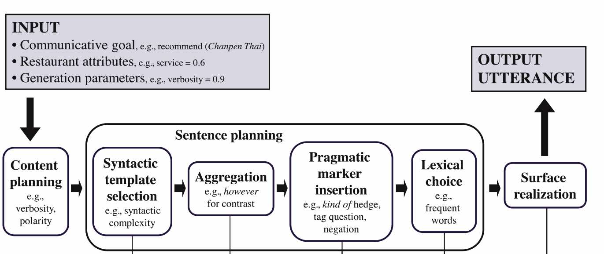

# The *Personage* demo

This demo illustrates how the `jsRealB` realizer can be used for varying the linguistic style of the generated text according to a user profile defined as one of the [Big Five](https://en.wikipedia.org/wiki/Big_Five_personality_traits) model of personality. 
It is a data-to-text application which realizes _personalized_ descriptions of restaurants. 
It uses the [Stylistic Variation data](https://nlds.soe.ucsc.edu/stylistic-variation-nlg),
found in the [_SIGGEN Datasets for NLG_ page](https://aclweb.org/aclwiki/Data_sets_for_NLG#Personage_Stylistic_Variation_for_NLG).

The data created by Oraby _et al._ [6] using the _Personage_ statistical generator [4] derives from the _meaning representation_ created for 
the [E2E NLG Challenge](http://www.macs.hw.ac.uk/InteractionLab/E2E) 
that comprises a set of attributes to describe an establishment described in the following table. 
The last attribute, not in the original E2E Challenge, indicates the type of personality that influences the organization and some of the lexical choices for the realization. 

Attribute       | Possible values
--------------- | ---------
name            | Blue Spice, Clowns, ...
near            | Crowne Plaza Hotel, Burger King, ...
area            | city centre, riverside
customerRating  | low, mediocre, average, decent, high, excellent
eatType         | pub, coffee shop, restaurant
familyFriendly  | no, yes
food            | Chinese, English, French, Indian, Italian, Japanese, fast food
priceRange      | 20-25, a lot, a small amount, cheap, high, moderate
**personality** | AGREEABLE, DISAGREEABLE, CONSCIENTIOUSNESS, UNCONSCIENTIOUSNESS, EXTRAVERT

The "name" and "near" field in the data are indicated as NAME and NEAR respectively. To make texts more readable, when the data is loaded, values for these attributes are randomly selected from the ones found in the E2E dataset. 

The concept of personalized text generation was originally developed in a series of models by François Mairesse and Marylin Walker between 2007 and 2011 [1,2,3,4] to adapt the utterances in the context of a dialog:
* PERSONAGE-RB a rule-based text generator for which the parameters were handcrafted;
* PERSONAGE-OS based on a statistical rescoring model to rank randomly generated utterances;
* PERSONAGE-PE whose generation parameters are determined by training parameter estimation models.

In this demo, we adapt the rule-based approach which was originally developed in Java to create Deep Syntactic Structures as defined in Meaning-Text Theory which were then realized with RealPro[7]. This demo reproduces the essential steps of this architecture with `jsRealb` showing the advantages of single programming language (_JavaScript_) for the complete realization process.   

We suggest to first try the system in [this web page](index.html) to get a feeling of the type of personalization that can be obtained for different combination of attribute values. The [file Personage.js](Personage.js) used can also be launched from the command line using `node` to compare the output of the test file with the one obtained by the system.

We first recall some features of `jsRealB`, then we present the organization of the original system and finally we adapted it to our context.
As the source code is available, this document only gives an overview of the system.

# Main features of `jsRealB`

`jsRealB` (JavaScript Realizer Bilingual) is a bilingual French and English text realizer that generates well-formed expressions and sentences and that can format them in HTML to be displayed in a browser. As its name indicates, `jsRealB` is written in JavaScript, a programming language that, when used in a web page, runs in the client browser. A web programmer who wishes to use `jsRealB` to produce flexible French or English textual output only needs to add one line in the header of the page, similarly to what is done for other browser frameworks such as jQuery. `jsRealB` is aimed at web developers. It carries out crucial tasks from taking care of morphology, subject-verb agreement and conjugation to creating entire HTML documents. 

In jsRealB, JavaScript expressions create data structures corresponding to the parts of the sentence to produce. When the need arises to produce a string realization (i.e. its `toString()` function is called), the data structure (a tree) is traversed to produce the tokens of the sentence, taking care of capitalization, elision and appropriate spacing around punctuation. It is also possible to wrap portions of text in HTML tags. The realizer accepts two types of input: constituents or dependents. Here, in accordance with the original system which structured its expression as Meaning-Text representation, we use the dependency based input notation.

The data structure is built by function calls whose names were chosen to be similar to the symbols typically used in linguistics:
* **Terminal**: `N` (Noun), `V` (Verb), `A` (adjective), `D` (determiner), `Pro` (pronoun), `Q` (quoted/verbatim text) ...
* **Dependent**: `root`, `subj` (subject), `comp` (complement), `mod` (modifier), `det` (determiner) and `coord` (coordinate)

Features added to these structures using the dot notation can modify their properties. For terminals, their person, number, gender can be specified. Dependents may be negated, set to a passive mode or be pronominalized. Punctuation signs and HTML tags can also be added. 
A dependency is specified by a function named after the dependency name taking as first parameter its head, a **Terminal**;  the other parameters, if any, are  **Dependent**s. Realization sorts the dependents of a relation: `det` and `subj` are realized before the head, `comp` and `mod` are realized after the head. The ordering within the specification is used in the case of ties both before and after the head. The `pos` feature, with value `"pre"` or `"post"`, can  alter the default ordering to force its realization before or after the head. The position of adjectives is dealt according to the rules of English or French grammar, unless changed by `pos`.

For example, the evaluation of  
``` javascript
let dep = root(V("like"),
               comp(N("shop"),
                   det(D("the")),
                   mod(A("nice")),
                   mod(N("coffee")).pos("pre")))
```
creates a dependency having as head the verb `"like"` and complement `"shop"`, modified by a determiner, an adjective and a noun. English determiners and adjectives are placed by default before the noun, but a noun placement before a noun must specified.`like` as head and a complement. No string value is yet realized, to get the final string, the following (or the equivalent in a string context such as `+""`)
``` javascript
dep.toString()
```
which returns

``` javascript
"Likes the nice coffee shop. " 
```
`dep` can then be modified, for example by adding a subject dependency and by modifying the type of the whole sentence, here adding a tag question.

``` javascript
dep.add(subj(N("boy"),det(D("the")))).typ({int:"tag"}).toString()
```
which evaluates to

```javascript
"The boy likes the nice coffee shop, doesn't he? "
```
More details about the realization process can be found in [8]. The full set of functions and options is described in the [documentation](../../documentation/user.html).

# A _simplistic_ text generator

We first describe a generator with a simple plan: first realize a sentence indicating the `name` and `eatType` of the establishment; then add a sentence for each attribute present in the data in which the subject is the pronoun `it`. The **personality** attribute is ignored for the moment.  

For example, given the following values for attributes:

Attribute       | Value
----------------| -----
name            | Loch Fyne
area            | city centre
near            | The Rice Boat
customerRating  | --
eatType         | restaurant
familyFriendly  | no
food            | fast food
priceRange      | --
**personality** | AGREEABLE

The realized text will be:

``` javascript
    "Loch Fyne is a restaurant. It is in the city centre. It is near The Rice Boat. It is not family-friendly. It serves fast food. "
```

Although this text is monotonic, creating it will show the building blocks of our realizer which creates dependencies to be modified afterwards. To each item of information is associated a dependency of the form `root(V(...),comp(...))` to which another dependency `subj(...)` can be added either at the initial `root` creation time or at a later time.  

The following function returns the first dependency depending on the fact that the  attribute `eatType` is present in `infos` (an object with the appropriate attributes).  If the `eatType` is not specified, a random choice in a list of common name is chosen using the `oneOf` function. This call does not return a string, but an internal structure that can be modified before being finally realized.

``` javascript
function name_eatType(infos){
    const qName=Q(infos["name"]); // create a terminal with the name verbatim
    if ("eatType" in infos){  // => qName is a eatType
        return root(V("be"),
                    subj(qName),
                    comp(N(infos["eatType"]),
                        det(D("a"))));
    } 
    return root(V("be"),   // => The place|venue|... is qName
                subj(N(oneOf(["place","venue","establishment","location"]))), // no eatType present, choose a commonplace name
                det(D("the")),  //
                comp(qName));
}
```

Here are two functions associated with the attributes `familyFriendly` and `food` that build dependencies with a verb as head and complement. A subject will be added later. Functions for other attributes (`area`, `near`, `customerRating` and `priceRange`) have a similar structure.

``` javascript
function familyFriendly(infos){  // => is not? family|kid friendly
    const ff_value = infos["familyFriendly"]=="yes";
    return root(V("be"),
                comp(oneOf(N("family").lier(),N("kid")),
                     mod(A("friendly")).pos("post"))).typ({neg:!ff_value})
}            

function food(infos){    // => serves fast|French|Chinese... food
    let food_value=infos["food"]
    if (food_value=="fast food")food_value="fast";
    return root(V("serve"),
                comp(N("food"),
                     mod(A(food_value))))
}
```

The final realization is obtained using the following function which creates a list of structures by calling each realization function in turn and finally creating the strings that are simply joined. `create_dep` calls the appropriate function depending on the attribute, e.g. `create_dep("food",infos)` merely calls `food(infos)`.

``` javascript
function simple_generate(infos){
    let res=[name_eatType(infos)]; // build list of dependency expressions by adding the it pronoun as subject
    for (let key of ['customerRating', 'area', 'near', 'familyFriendly', 'food', 'priceRange']) {
        if (key in infos)
            res.push(create_dep(key,infos).add(subj(Pro("it").c("nom"))));
    }
    return res.map(e=>e.toString()).join(""); // realize each expression as a list
}
```
The call `simple_generate(infos)` returns the string shown at the beginning of this section.
Before explaining how this approach can be incorporated in a more complex plan integrating personalization, we describe the system that served as inspiration for this demo. 

# Organization of the _original_ Personage system

Mairesse presents the architecture of the system in the following figure (taken from Figure 1 of [4, p. 461]).



described as follows
>"The content planner specifies the structure of the information to be conveyed. The resulting content plan tree is then processed by the sentence planner, which selects syntactic templates for expressing individual propositions, and aggregates them to produce the utterance’s full syntactic structure. The pragmatic marker insertion component then modifies the syntactic structure locally to produce various pragmatic effects, depending on the markers’ insertion constraints. The lexical choice component selects the most appropriate lexeme for each content word, given the lexical selection parameters. Finally, the RealPro surface realizer converts the final syntactic structure into a string by applying surface grammatical rules, such as morphological inflection and function word insertion."`

# Organization of the Personage demo

## Personalization parameters
The personality parameters are defined by groups of attributes some of which are values between 0 and 1 and others are boolean. These attributes determine the probability that certain rules implementing these parameters will be applied at each step of the text generation. We only give here the definition for `extraversion`, the four other personalities are defined similarly closely matching the choices described by Mairesse.

``` javascript
const high = 0.9, low = 0.1;
//  Extraverts tend to engage in social interaction, they are enthusiastic, risk-taking, talkative and assertive,
//  whereas introverts are more reserved and solitary. (p 83 of Mairesse 2008)
const extraversion = {
    content_planning: new ContentPlanning({
        verbosity: high,
        restatements: high,
        repetitions: high,
        content_polarity: high,
        repetitions_polarity: high,
        concessions_polarity: high,
        positive_content_first: high,
        request_confirmation: true,
    }),
    syntactic_template_selection: new SyntacticTemplateSelection({
        syntactic_complexity: low,
        template_polarity: high,
    }),
    aggregation: [
        [also_cue_word, high],
        [but_cue_word, high],
        [although_cue_word, low],
        [relative_clause, low],
    ],
    pragmatic_marker: [
        [subject_implicitness, high],
        [soft_hedges, high],
        [near_expletives, high],
        [emphasizer_hedges, high],
        [exclamation, high],
        [tag_question, high],
        [in_group_marker, high],
        [negation, low],
        [softener_hedges, low],
        [acknowledgements, low],
        [filled_pauses, low]
    ]
}
```

The values for content planning and syntactic template selection are defined by calling the following constructors that define fields with a null default value, the ones that are applicable are updated when they are called (see above). The values for the `aggregation` and `pragmatic_marker` are list of JavaScript functions that will be applied. Some of these functions will be shown later.  The important aspect to remember is the declarative nature of each personality. 

To decide when a generation parameter is applicable, a random number in the range (0,1] is drawn before calling the associated function and if this number is less than the value (0.9 when `high`), then the function is called to modify the dependency. When a parameter is a boolean, then is applied when the value is `true`. If the parameter is not specified, then it is not applied.

``` javascript
//   Content planning: refine communicative goals, select and structure the propositional content, 
function ContentPlanning(params = {}) {
    // set default values
    this.verbosity = null;              // C: Control the number of propositions in the utterance
    this.restatements = null;           // C: Paraphrase an existing proposition
    this.repetitions = null;            // C: Repeat an existing proposition
    this.content_polarity = null;       // C: Control the polarity of the propositions depessed, i.e., referring to negative or positive attributes
    this.repetitions_polarity = null;   // C: Control the polarity of the restated propositions
    this.concessions = null;            // C: Emphasize one attribute over another
    this.concessions_polarity = null;   // C: Determine whether positive or negative attributes are emphasized
    this.polarization = null;           // C: Control whether the depessed polarity is neutral or extreme
    this.positive_content_first = null; // C: Determine whether positive propositions—including the claim—are uttered first
    // in the thesis (p 112), 
    //   these content planning parameters are modelled at the pragmatic marker insertion level as they 
    //   only affect the beginning of the utterance (described in page 119, table 5.4)
    this.request_confirmation = null;   // B: Begin the utterance with a confirmation of the restaurant’s name
    this.initial_rejection = null;      // B: Begin the utterance with a mild rejection
    this.competence_mitigation = null;  // B: depess the speaker’s negative appraisal of the hearer’s request    
    Object.assign(this,params)       // change fields to corresponding values given as parameters
}

//  Syntactic template selection: decide what syntactic template to select for expressing each proposition, 
function SyntacticTemplateSelection(params = {}) {
    this.self_references = null;      // C: Control the number of first person pronouns
    this.syntactic_complexity = null; // C: Control the syntactic complexity (syntactic embedding)
    this.template_polarity = null;    // C: Control the connotation of the claim, i.e., whether positive or negative affect is expressing
    Object.assign(this,params)      // change fields to corresponding values given as parameters
}
```

## Content planner

The first task of a text generator is to determine _What to say_, in our setting this would imply selecting the attributes to show to the reader. But given the fact, that our data has only a 8 attributes at the most to present, this selection step is skipped so that all attribute values are realized. But the context planner might change the field ordering when the `positive_content_first` content planner parameter is applicable. If this the case, then a good or excellent customer rating, the fact that the establishment is kid friendly or that the prices are cheap will be presented first.  A field can be repeated if the `restatement` or `verbosity` parameter is applicable.

The content planner then initializes the first dependency using the function `name_eatType` described in the simple text generator.  As done by Mairesse, some content planning parameters are modeled as pragmatic markers that modify this first dependency. For example, if the `request_confirmation` parameter is applicable then the phrases such as _You want to know more about ..._ or _Did you say ..._ are inserted. If `initial_rejection` is applicable, then _I don't know_ or _I might be wrong_ is inserted. If `competence_mitigation` is applicable, a formulation such as _come on_ or _everybody knows that_ is added.

## Syntactic templates

## Aggregation parameters

## Pragmatic parameters


# References
[1] François Mairesse. Learning to Adapt in Dialogue Systems: Data-driven Models for Personality Recognition and Generation. Ph.D. thesis, University of Sheffield, Department of Computer Science, 2008. [<a href="http://farm2.user.srcf.net-research-personage-personage-0.13.tar.gz">source code of the original program</a>]

[2] François Mairesse and Marilyn Walker. PERSONAGE: Personality Generation for Dialogue. In Proceedings of the 45th Annual Meeting of the Association for Computational Linguistics (ACL), Prague, June 2007. 

[3] François Mairesse and Marilyn Walker. Trainable Generation of Big-Five Personality Styles through Data-driven Parameter Estimation. In Proceedings of the 46th Annual Meeting of the Association for Computational Linguistics (ACL), Columbus, June 2008. 

[4] François Mairesse and Marilyn Walker. Towards personality-based user adaptation: psychologically informed stylistic language generation. User Modeling and User-Adapted Interaction 20, 227–278 (2010). [[PDF](https://users.soe.ucsc.edu/~maw/papers/umuai2010.pdf)]

[5] François Mairesse and Marilyn Walker. Controlling User Perceptions of Linguistic Style: Trainable Generation of Personality Traits. Computational Linguistics, 37(3), 2011. 

[6] S. Oraby, L. Reed, S. Tandon, S. TS, S. Lukin, and M. Walker. Controlling Personality-Based Stylistic Variation with Neural Natural Language Generators.  SIGDIAL 2018. Melbourne, Australia. [[PDF](https://arxiv.org/abs/1805.08352)]

[7] Benoit Lavoie and Owen Rambow. A fast and portable realizer for text generation systems.
In Proceedings of the 5th. Conference on Applied Natural Language Processing, pages 265--268, Washington, D.C., 1997. Association for Computational Linguistics.

[8] G. Lapalme. The jsRealB text realizer: Organization and use cases. ([arXiv:2012.15425](https://arxiv.org/pdf/2012.15425.pdf)), may 2022.

---
[Guy Lapalme](mailto:lapalme@iro.umontreal.ca)
